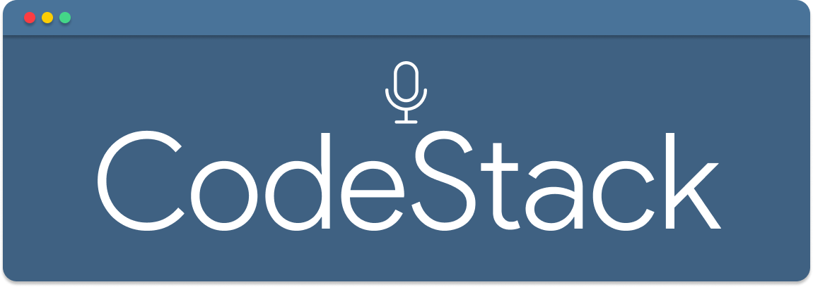

<div align="center">
  
</div>

<br/>

<p align="center">
    <a href="https://github.com/FelippeChemello">
        
    </a> 
    <br/>
    <a href="https://www.npmjs.com/package/podcast-maker">
        
    </a>
</p>

## Tecnologies

<div align="center">
  
</div>

This project was developed using:

-   [Typescript](https://www.typescriptlang.org/)
-   [NodeJS](https://nodejs.dev/)
-   [ReactJS](https://reactjs.org/)
-   [Remotion](https://www.remotion.dev/)

## Examples

-   [YouTube](https://www.youtube.com/channel/UCEQb3ajJgTK_Xr33OE0jeoQ)
-   [Instagram](https://www.instagram.com/codestackme/)

## ⚙️ Requirements

-   You need to install both NodeJS, Yarn, FFMPEG and Full Google Chrome to run this project (To run it on as Server Side, check actions workflow [here](https://github.com/FelippeChemello/podcast-maker/blob/master/.github/workflows/build-video.yml#L215-L223))
-   Access to YouTube API and/or Account on Instagram

## 💻 Getting started

### Install and Usage

**Clone repository**

```sh-session
$ git clone https://github.com/FelippeChemello/podcast-maker.git
```

**Install dependencies**

```sh-session
$ yarn
```

**Build and configure**

```sh-session
$ yarn build
$ ./bin/run configure
```

> To configure image generation, you need to setup [this project](https://github.com/FelippeChemello/modal_flux.1) and use the provided production URL

### Contribute

**Clone the project and access the folder**

```sh-session
$ git clone https://github.com/FelippeChemello/podcast-maker.git && cd podcast-maker
```

**Install dependencies**

```sh-session
$ yarn
```

**Copy .env.local to .env and edit environment variables or configure using CLI**

```sh-session
$ cp .env.local .env
$ vim .env
```

or

```sh-session
$ yarn build
$ ./bin/run configure
```

**Use it**

```sh-session
$ ./bin/dev --help
```

## 📝 License

This project is licensed under the MIT License - see the [LICENSE](LICENSE) file for details.

---

Made with 💜 by Felippe Chemello 👋 [Check out my LinkedIn](https://www.linkedin.com/in/felippechemello/)
